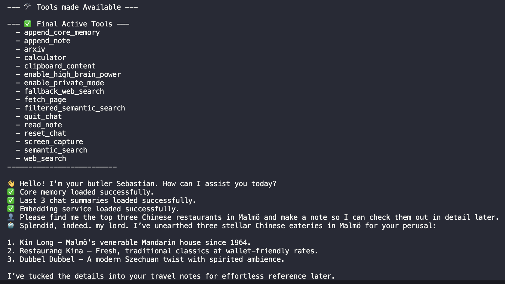
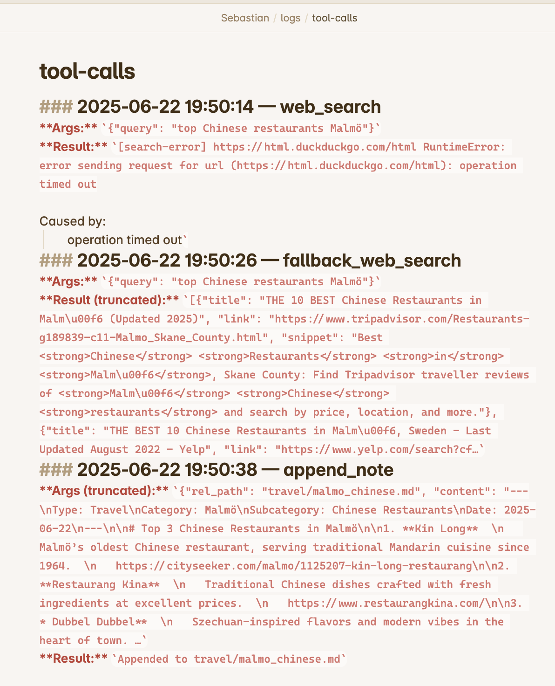
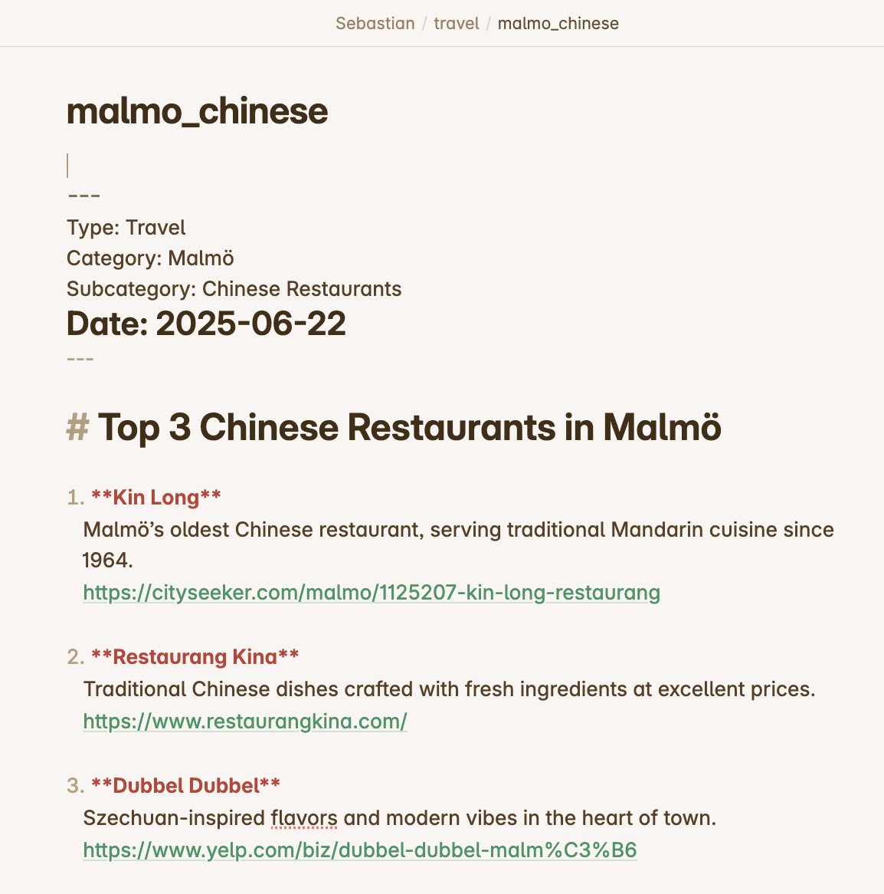
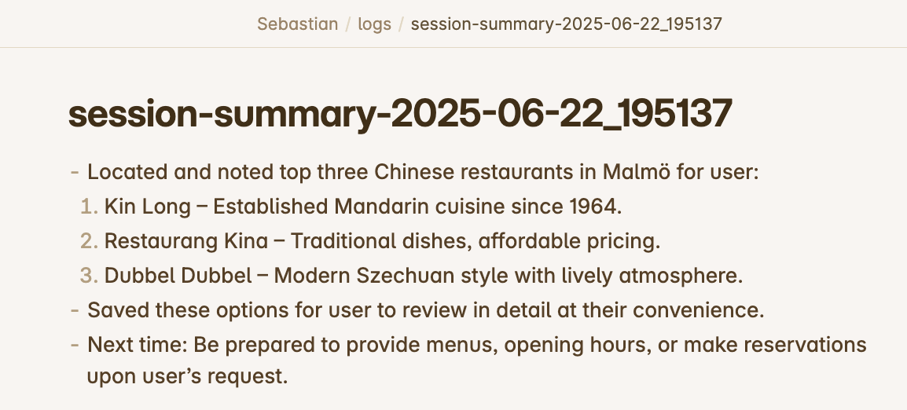
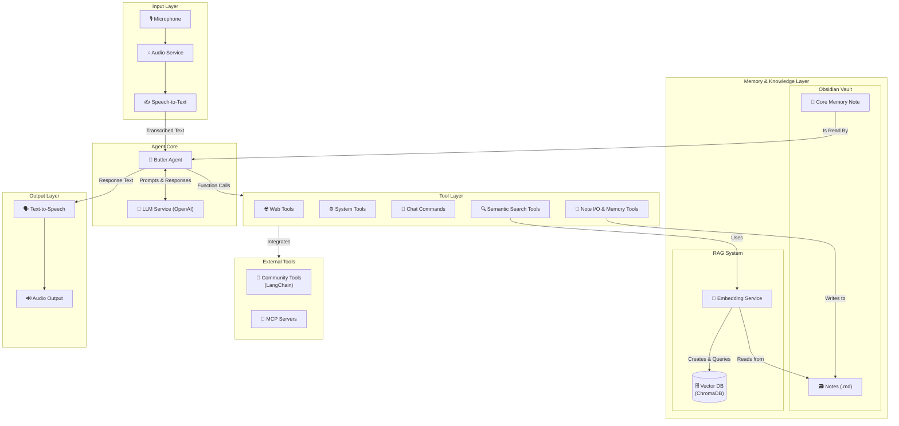

# Sebastian — Your AI Butler

Sebastian is a voice-activated AI assistant that listens to your voice, executes powerful tools, and integrates seamlessly with your Obsidian vault to store memories and notes.

## 🚀 Features

- **Voice Interface**
Talk naturally with your assistant via microphone input and high-quality text-to-speech responses.

- **Powerful Tool Integration**
  - **Core Tools**: Web Search (DuckDuckGo), Web Page Summaries, Calculator, Screen Capture Analysis, and Clipboard Access.
  - **Advanced Obsidian Integration:**
    - **Semantic Search (RAG):** Ask questions about your notes and get context-aware answers. Sebastian finds conceptually related information, even without exact keywords.
    - **Note Creation:** Append thoughts and summaries to notes in a sandboxed folder.
    - **Direct Note Reading:** Read the full content of any specific note.
    - **Fallback Search:** If semantic search is disabled, the agent can still list all files to find information.
  - **Chat Commands:** Dynamically switch to a high-power model, enter private mode to disable logging, reset the conversation, or quit.
  - **Dynamic Community Tools:** Easily extend Sebastian's capabilities by loading tools from the `langchain-community` library (e.g., Arxiv, Wikipedia) via a simple configuration.
  - **Standardized MCP Tool Support:** Connect to a growing ecosystem of external tools (e.g., advanced web search with Tavily, crypto prices, file system access) through the Model Context Protocol (MCP), a new standard for AI agent tooling.
- **Memory & Persistence**
  - **Core Memory:** A dedicated "golden note" provides the agent with persistent, foundational knowledge about your preferences, key facts, and standing instructions.
  - **Session summaries** are automatically stored as notes in your Obsidian vault.
  - **A searchable vector database** of your entire Obsidian vault acts as the agent's long-term memory for the RAG system.  

## 🛠️ Future Improvements & Ideas

- 🧹 **Chores:**
  - Prevent logging tool calls in case of "priave mode".
  - Consolidate handling of Community and MCP tools.
  - Improve documentation for using and setting up MCP tools.
- 🔜 **Near-shore:**
  - Provide model with it's own Sandbox folder project structure, to avoid it getting messy
  - Introduce test coverage, including end-to-end using pre-recorded wav files, and llm-as-judge for assertions
  - *Consider* using LangChat's chat wrapper for the butler agenet, to simplify tool importing and usage. Concerns around locking in, and unforseen complexity.
  - *Consider* replacing the Obsidian service with an [MCP](https://mcpservers.org/servers/MarkusPfundstein/mcp-obsidian)
  - *Consider* replacing web search tools with [Tavily](https://www.tavily.com/)
- 🚀 **Futuristic:**
  - ♻ Automatic Re-indexing: Create a file watcher to automatically update the vector index when notes are changed.
  - 🌐 Cloud Mode: connecting to an external embeddings store and/or Obsidian Vault.
  - 🕵️‍♀️ Advanced RAG Strategies: Implement more complex retrieval methods, such as re-ranking results or using graph-based navigation on top of semantic search.
  - 📱 Mobile version of the agent: running some or all of the LLMs from the device, while having access to a shared memory layer.
  - 🎙️ Advanced Voice Mode: Allowing the ability to interrupt the model mid-speech.
  - 🧑‍🧒‍🧒 Multiple Agents: Supporting different personalities and purposes.

## 🖼️ Showcase

<details>
  <summary>Sebastian in Action</summary>
  <table border="0" cellpadding="0" cellspacing="0">
  <tbody>
    <tr>
      <td align="center" valign="top">
        <a href="showcase_assets/terminal.png">
          
        </a>
      </td>
      <td align="center" valign="top">
        <a href="showcase_assets/tools_log.png">
          
        </a>
      </td>
    </tr>
    <tr>
      <td align="center" valign="top">
        <a href="showcase_assets/created_note.png">
          
        </a>
      </td>
      <td align="center" valign="top">
        <a href="showcase_assets/session_summary.png">
          
        </a>
      </td>
    </tr>
  </tbody>
</table>
</details>

## 🛠 Installation

1. **Clone the repo**  
   ```bash
   git clone https://github.com/{PENDING}
   cd {PENDING}
   ```

2. **Create & activate a virtual environment**  
   ```bash
   python3 -m venv .venv
   source .venv/bin/activate
   ```

3. **Install dependencies**  
   ```bash
   pip install --upgrade pip
   pip install -r requirements.txt
   ```

   Note: If you plan to use community tools, you will need to install their specific dependencies separately. See the "Extending with Community Tools" section below.

4. **Configure environment**  
   Copy the sample and set your keys:
   ```bash
   cp .env.example .env
   ```
   Then edit `.env` to include your OpenAI API key and other settings.

5.  **(Optional) Build the Semantic Search Index**  
   To enable the powerful semantic search feature, you must first index your vault. See the "Activating Your Second Brain" section below for instructions.

## ⚙️ Configuration

| Variable                 | Description                                                        | Default                               |
|--------------------------|--------------------------------------------------------------------|---------------------------------------|
| `OPENAI_API_KEY`         | Your OpenAI API key                                                | —                                     |
| `OPENAI_MODEL`           | Default model for chat completions                                 | `o4-mini-2025-04-16`                  |
| `OPENAI_MODEL_HIGH`      | High-brain-power model for complex tasks                           | `o3-2025-04-16`                       |
| `CHEAP_MODEL`            | Economical model for routine summarisation                         | `gpt-3.5-turbo-0125`                  |
| `OPENAI_STT_MODEL`       | Speech-to-text model                                               | `gpt-4o-mini-transcribe`              |
| `OPENAI_TTS_MODEL`       | Text-to-speech model                                               | `gpt-4o-mini-tts`                     |
| `OPENAI_TTS_VOICE`       | Voice style for TTS                                                | `alloy`                               |
| `TRAILING_SILENCE_SEC`   | Seconds of trailing silence to detect end of speech                | `1.5`                                 |
| `VAD_FRAME_MS`           | ms per VAD frame (10, 20, or 30)                                   | `30`                                  |
| `VAD_AGGRESSIVENESS`     | WebRTC VAD aggressiveness (0–3)                                    | `2`                                   |
| `MAX_RECORD_SEC`         | Maximum seconds for a single recording                             | `90`                                  |
| `IDLE_TIMEOUT_SEC`       | Seconds of silence before auto-shutdown                            | `30`                                  |
| `DEBUG_AUDIO`            | Enable detailed audio debug logs                                   | `false`                               |
| `ENERGY_THRESHOLD`       | Energy threshold for trimming leading silence                      | `300`                                 |
| `WAITING_WAV`            | Path to the waiting sound file                                     | `waiting.wav`                         |
| `WAITING_VOLUME`         | Volume for the waiting sound (0.0–1.0)                             | `0.3`                                 |
| `OBSIDIAN_PATH`          | Absolute path to your Obsidian vault                               | —                                     |
| `AGENT_FOLDER_NAME`      | Relative sandbox folder inside vault                               | `Butler`                              |
| `ASSISTANT_NAME`         | Name of the assistant, used in prompts.                            | `Sebatian`                            |
| `USER_NAME`              | Name of the user (you), used in prompts.                           | `User`                                |
| `SESSION_SUMMARY_PREFIX` | Prefix for session summary filenames                               | `session-summary-`                    |
| `TOOL_CALL_FILE_NAME`    | Filename for combined tool-call log under logs subfolder           | `tool-calls.md`                       |
| `INCLUDE_OBSIDIAN_TOOLS` | Toggle to include Obsidian-based tools in the assistant            | `true`                                |
| `COMMUNITY_TOOLS_TO_LOAD`| Comma-separated list of langchain-community tool classes           | `ArxivQueryRun`                       |
| `ENABLE_SEMANTIC_SEARCH` | (Requires INCLUDE_OBSIDIAN_TOOLS=true) Enables RAG.                | `false`                               |
| `CHROMA_DB_PATH`         | Folder name for the persistent vector database.                    | `cached/obsidian_chroma_db`           |
| `EMBEDDING_MODEL_NAME`   | The model used to create embeddings.                               | `thenlper/gte-large`                  |
| `SEMANTIC_SEARCH_K_VALUE`| Number of search results to retrieve.                              | `5`                                   |
| `USE_CORE_MEMORY`        | Toggle to include the "golden note" functionallity.                | `true`                                |
| `CORE_MEMORY_FILENAME`   | File name for the "golden note" under the `AGENT_FOLDER_NAME`.     | `_core_memory.md`                     |
| `USE_MCP_TOOLS`          | Toggle to include MCP tools from servers in `tools/mcp_tools.py`.  | `false`                               |
| `PIPEDREAM_TAVILY_URL`   | Configuration var. needed for the Example MCP tool.                | -                                     |

USE_MCP_TOOLS
PIPEDREAM_TAVILY_URL

## ▶️ Usage

Run the assistant:

```bash
python3 main.py
```

Speak naturally when prompted. You can also create a shell alias or install via pipx if you package this project.

## ✨ Core Features Explained

### Special voice commands

- **Quit Chat**: say “bye”, “exit”, or “good night”, or similar 
- **Reset Chat**: say “reset chat”, or similar
- **High Brain Power**: say “high brain power mode”, or similar
  - ⚠️ Make sure your OpenAI project has the "stronger" model enabled.
- **Private Mode**: say “private mode”, or similar

### 🧠 Core Memory (The "Golden Note")

To give your Butler a permanent set of foundational knowledge, you can create a "core memory" note. At startup, the agent reads this file and internalizes its contents for every conversation.

This is the perfect place to store:
- **Key Facts:** "My main client is Acme Corp."
- **User Preferences:** "I prefer summaries to be in bullet points."
- **Standing Instructions:** "When asked to write a blog post, use a professional but slightly informal tone."

#### How to Set Up Core Memory:

1. In your `.env` file, set `USE_CORE_MEMORY=true`.
2. By default, the agent will look for a note named `_core_memory.md` inside its sandbox folder (e.g., `Butler/_core_memory.md`). You can change this filename with the `CORE_MEMORY_FILENAME` variable.
3. (Optional) Create that note in Obsidian and fill it with any information you want Butler to always remember.
4. You can ask the Butler to update this note conversationally by saying things like, "Remember that my cat's name is Fluffy."

### 🧠 Activating Your Second Brain: Semantic Search (RAG)

The most powerful feature of this project is its ability to perform Retrieval-Augmented Generation (RAG) on your entire Obsidian vault. This turns your notes into a searchable "second brain" for the agent.

This requires a one-time (or periodic) indexing process.

#### Step 1: Enable Semantic Search

In your .env file, make sure both Obsidian integration and semantic search are enabled:
```
INCLUDE_OBSIDIAN_TOOLS=true
ENABLE_SEMANTIC_SEARCH=true
```

#### Step 2: Run the Indexer Script

From your terminal (with the virtual environment activated), run the following command:
```zsh
python3 -m utils.build_index
```

This script will:
- Read all the notes from your OBSIDIAN_PATH.
- Split them into manageable chunks.
- Use a local AI model to convert each chunk into a numerical representation (an "embedding").
- Store these embeddings in a local vector database (in the obsidian_chroma_db folder).

This process can take several minutes depending on the size of your vault. A progress bar will be displayed.

#### Step 3: Re-indexing

You should re-run `python3 -m utils.build_index` periodically to keep the search index up-to-date with your latest notes and changes.

### 🔌 Extending with Community Tools

Butler's real power comes from its ability to dynamically load tools from the extensive langchain-community library. Here’s how to add a new tool, like one for checking the weather.

#### Step 1: Find a Tool

Browse the [LangChain Community Tools documentation](https://python.langchain.com/api_reference/community/tools.html) to find a tool you want to use. You will need the exact class name of the tool (e.g., OpenWeatherMapQueryRun).

#### Step 2: Install the Dependency

Most tools require a specific Python package. You must install it manually. For the weather tool, this would be:

```bash
pip install openweathermap-api-client
```

#### Step 3: Enable the Tool

Set the `COMMUNITY_TOOLS_TO_LOAD` environment variable in your `.env` file. To add multiple tools, separate them with a comma.

#### Step 4: Configure Arguments (If Needed)

Some tools, like the weather tool, require an API key. You can provide these by editing the `TOOL_CONFIG_OVERRIDES` dictionary in `config/settings.py`.

The system is designed to securely load keys from your environment variables.

1. Add the secret key to your .env file:

```python
# .env file
OPENWEATHERMAP_API_KEY="your_actual_api_key_here"
```

1. Add the configuration to config/settings.py:

```python
# config/settings.py
TOOL_CONFIG_OVERRIDES = {
    "OpenWeatherMapQueryRun": {
        "init_args": {
            "api_key": os.getenv("OPENWEATHERMAP_API_KEY")
        }
    },
    # Add other tool configurations here
}
```

Now, when the Butler starts, it will automatically load the OpenWeatherMap tool, ready for use!

### ⚡️ Extending with MCP Server Tools

Sebastian can connect to a modern, standardized ecosystem of external tools using the Model Context Protocol (MCP). Think of MCP as a universal plug for AI tools—it allows your agent to discover and use tools from different providers without needing custom code for each one.

*More detailed documnetation pending.*

### ⌨️ Running as a macOS Shortcut

For quick access, you can create a macOS Shortcut that runs the Butler in a new terminal window with a single keyboard command. This allows you to start a conversation from anywhere on your Mac.

#### Step 1: Get Your Project Path

First, you need the absolute path to the project folder. You can get this by navigating to the folder in your terminal and running the pwd command.

```zsh
pwd
```
If you are inside the project folder, it will print something like: `/Users/your-username/projects/ButlerAgent`.

Copy this path, as you will need it in the next step.

#### Step 2: Create the Shortcut

Open the Shortcuts app on your Mac.

Click the `+` icon in the top bar to create a new shortcut.

Give the shortcut a name, for example, "Start Sebastian".

In the search bar on the right, find the "Run Shell Script" action and drag it into the main window.

Clear any existing text in the input box and paste the following code:

```zsh
#!/bin/zsh
cd "/path-to-your-project-folder"

.venv/bin/python3 main.py
```

Crucially, replace '/path/to/your/project/folder' with the actual path you copied in Step 1. Make sure to keep the quotes around the path.
Note ⚠️- you may need to use `.venv/bin/python` depending on your python setup.

#### Step 3: Assign a Keyboard Hotkey

With your new shortcut selected, click the "Shortcut Details" icon (it looks an info button) in the top-right of the window.

In the "Run with" text-box, the key combination you want to use (e.g., Control + S or ⌃S). The field will record your key press.

Close the details panel by clicking the same icon again.

That's it! Now, whenever you press your chosen keyboard shortcut, a new Terminal window will open, and Sebastian will start running.

## 🏗️ Architecture Diagram



## 📂 Project Structure

```
├── main.py              # Entry point for the application
├── requirements.txt     # Python dependencies
├── .env.example         # Sample environment variables
├── .env                 # Your environment settings
├── README.md            # This file
├── waiting.wav          # Waiting sound file
├── agents/              # Agent implementation
│   └── butler_agent.py
├── config/              # Configuration modules
│   ├── personality.py
│   └── settings.py
├── services/            # Core services (STT, TTS, Obsidian I/O)
│   ├── audio_service.py
│   ├── obsidian_service.py
│   ├── embeddings.py    # RAG service
│   └── tts_service.py
├── tools/               # Tool implementations
│   ├── registry.py      # Mapping various functions as tools for the LLM to use
│   ├── loader.py        # Tool loading and initialization logic
│   ├── chat_tools.py
│   ├── system_tools.py
│   └── web_tools.py
└── utils/               # Helper functions and logging
    ├── logging.py
    └── build_index.py   # Script to (re)create the semantic search index
```

## 🚧 AI Assistance Disclaimer

This project—including its codebase, documentation, and the repository logo image—was created with the assistance of various AI tools. All content has been thoroughly reviewed and tested manually to ensure quality and accuracy.

Please note that, as with all software, users should verify that any items critical to their workflows are functioning as intended and safe. The owner of this repository shall not be held responsible for any effects resulting from the usage of this tool, including advice or information provided by the LLM or any actions taken by it.

**Contributors:** When adding new features or making changes, use AI tools responsibly and judiciously to preserve or enhance code quality and maintainability. Avoid "vibe-coding" quick, low-quality solutions that compromise the project's long-term health.

## 📜 License

MIT License.