# Sebastian — Your AI Butler

Sebastian is a voice-activated AI assistant that listens to your voice, executes powerful tools, and integrates seamlessly with your Obsidian vault to store memories and notes.

## 🚀 Features

- **Voice Interface**
Talk naturally with your assistant via microphone input and high-quality text-to-speech responses.

- **Powerful Tool Integration**
  - **Centralized YAML Configuration:** All tools— Core, Obsidian, Community, and MCPs—are managed from a single `tools_config.yaml` file. Easily toggle features, configure API keys, and even override tool names and descriptions from one place.
  - **Core Tools**: Web Search (DuckDuckGo), Web Page Summaries, Calculator, Screen Capture Analysis, and Clipboard Access.
  - **Advanced Obsidian Integration:**
    - **Semantic Search (RAG):** Ask questions about your notes and get context-aware answers. Sebastian finds conceptually related information, even without exact keywords.
    - **Note Creation:** Append thoughts and summaries to notes in a sandboxed folder.
    - **Direct Note Reading:** Read the full content of any specific note.
    - **Fallback Search:** If semantic search is disabled, the agent can still list all files to find information.
  - **Chat Commands:** Dynamically switch to a high-power model, enter private mode to disable logging, reset the conversation, or quit.
  - **Dynamic Community Tools:** Easily extend Sebastian's capabilities by loading tools from the `langchain-community` library (e.g., Arxiv, Wikipedia) via a simple configuration.
  - **Standardized MCP Tool Support:** Connect to a growing ecosystem of external tools (e.g., advanced web search with Tavily, crypto prices, file system access) through the Model Context Protocol (MCP), a new standard for AI agent tooling.
- **Memory & Persistence**
  - **Core Memory:** A dedicated "golden note" provides the agent with persistent, foundational knowledge about your preferences, key facts, and standing instructions.
  - **Session summaries** are automatically stored as notes in your Obsidian vault.
  - **A searchable vector database** of your entire Obsidian vault acts as the agent's long-term memory for the RAG system.  

## 🛠️ Future Improvements & Ideas

- 🧹 **Chores:**
  - /
- 🔜 **Near-shore:**
  - 🕷️ Introduce separate vector stores, web-scraper (like [craw4ai](https://github.com/unclecode/crawl4ai)), and management util to list and delete stores easily.
    - Alternatively, use a [Chroma MCP](https://hub.docker.com/r/mcp/chroma) to manage multiple vector stores.
  - ⚗️ Introduce test coverage, possibly including end-to-end using pre-recorded wav files, and llm-as-judge for assertions.
  - *Consider* using LangChat's chat wrapper for the butler agenet, to simplify tool importing and usage.
    - ⚠️ Concerns around locking in, and unforseen complexity.
    - ➕ Allows for llm provider interchangability.
  - **Consider** adding utilities for [Docker MCP Toolkit](https://docs.docker.com/ai/mcp-catalog-and-toolkit/toolkit/) setup, then:
    - *Consider* replacing the Obsidian service with an [MCP](https://hub.docker.com/r/mcp/obsidian).
      - ⚠️ Should include a clean approach to switching between local and MCP Obsidian.
    - *Consider* using the [Memory MCP](https://hub.docker.com/r/mcp/memory) instead of the "golden memory".
      - ⚠️ Should include a clean approach to switching between local and MCP memory.
    - *Consider* replacing the Embeddings service with the [Chroma MCP](https://hub.docker.com/r/mcp/chroma).
      - ⚠️ Should include a clean approach to switching between local and MCP embeddings.
    - *Consider* replacing web search tools with [Tavily](https://hub.docker.com/r/mcp/tavily).
      - ⚠️ Should include a clean approach to switching between local and MCP web search.
- 🚀 **Futuristic:**
  - ⏰ Scheduled Tasks: Allow the agent to perform tasks at scheduled times, such as daily summaries or reminders.
    - Would ideally include a way to reach out to the user via a notification or a (eg. slack) message.
  - ♻ Automatic Re-indexing: Make sure Obsidian is re-indexed regularly, or reactively.
  - 🌐 Cloud Mode: connecting to an external embeddings store and/or Obsidian Vault, allowing for multi-device access.
  - 📱 Mobile version of the agent: running some or all of the LLMs from the device, while having access to a shared memory layer.
  - 🕵️‍♀️ Advanced RAG Strategies: Implement more complex retrieval methods, such as re-ranking results or using graph-based navigation on top of semantic search.
    - Alternatively, use a [Memory MCP](https://hub.docker.com/r/mcp/memory).
  - 🎙️ Advanced Voice Mode: Allowing the ability to interrupt the model mid-speech.
  - 🧑‍🧒‍🧒 Multiple Agents: Supporting different personalities and purposes.

## 🖼️ Showcase

<details>
  <summary>Sebastian in Action</summary>
  <table border="0" cellpadding="0" cellspacing="0">
  <tbody>
    <tr>
      <td align="center" valign="top">
        <a href="showcase_assets/terminal.png">
          
        </a>
      </td>
      <td align="center" valign="top">
        <a href="showcase_assets/tools_log.png">
          
        </a>
      </td>
    </tr>
    <tr>
      <td align="center" valign="top">
        <a href="showcase_assets/created_note.png">
          
        </a>
      </td>
      <td align="center" valign="top">
        <a href="showcase_assets/session_summary.png">
          
        </a>
      </td>
    </tr>
  </tbody>
</table>
</details>

## 🛠 Installation

1. **Clone the repo**  
   ```bash
   git clone https://github.com/{PENDING}
   cd {PENDING}
   ```

2. **Create & activate a virtual environment**  
   ```bash
   python3 -m venv .venv
   source .venv/bin/activate
   ```

3. **Install dependencies**  
   ```bash
   pip install --upgrade pip
   pip install -r requirements.txt
   ```

   Note: If you plan to use community tools, you will need to install their specific dependencies separately. See the "Extending with Community Tools" section below.

4. **Configure Environment & Tools**

**Environment Variables:** Copy the sample `.env.example` file. This file holds your secret keys and high-level settings.

```Bash
cp .env.example .env
```

Then edit `.env` to include your `OPENAI_API_KEY` and any other required secrets (e.g., `BRAVE_SEARCH_API_KEY`, `PIPEDREAM_TAVILY_URL`).

**Tool Configuration:** Copy the sample `tools_config.example.yaml` and rename to `tools_config.yaml`. This file is your control panel for all of Sebastian's tools.

5.  **(Optional) Build the Semantic Search Index**  
   To enable the powerful semantic search feature, you must first index your vault. See the "Activating Your Second Brain" section below for instructions.

## ⚙️ Configuration

| Variable                 | Description                                                        | Default                               |
|--------------------------|--------------------------------------------------------------------|---------------------------------------|
| `OPENAI_API_KEY`         | Your OpenAI API key                                                | —                                     |
| `OPENAI_MODEL`           | Default model for chat completions                                 | `o4-mini-2025-04-16`                  |
| `OPENAI_MODEL_HIGH`      | High-brain-power model for complex tasks                           | `o3-2025-04-16`                       |
| `CHEAP_MODEL`            | Economical model for routine summarisation                         | `gpt-3.5-turbo-0125`                  |
| `OPENAI_STT_MODEL`       | Speech-to-text model                                               | `gpt-4o-mini-transcribe`              |
| `OPENAI_TTS_MODEL`       | Text-to-speech model                                               | `gpt-4o-mini-tts`                     |
| `OPENAI_TTS_VOICE`       | Voice style for TTS                                                | `alloy`                               |
| `TRAILING_SILENCE_SEC`   | Seconds of trailing silence to detect end of speech                | `1.5`                                 |
| `VAD_FRAME_MS`           | ms per VAD frame (10, 20, or 30)                                   | `30`                                  |
| `VAD_AGGRESSIVENESS`     | WebRTC VAD aggressiveness (0–3)                                    | `2`                                   |
| `MAX_RECORD_SEC`         | Maximum seconds for a single recording                             | `90`                                  |
| `IDLE_TIMEOUT_SEC`       | Seconds of silence before auto-shutdown                            | `30`                                  |
| `DEBUG_AUDIO`            | Enable detailed audio debug logs                                   | `false`                               |
| `ENERGY_THRESHOLD`       | Energy threshold for trimming leading silence                      | `300`                                 |
| `WAITING_WAV`            | Path to the waiting sound file                                     | `waiting.wav`                         |
| `WAITING_VOLUME`         | Volume for the waiting sound (0.0–1.0)                             | `0.3`                                 |
| `OBSIDIAN_VAULT_PATH`    | Absolute path to your Obsidian vault                               | —                                     |
| `AGENT_FOLDER_NAME`      | Relative sandbox folder inside vault                               | `Butler`                              |
| `ASSISTANT_NAME`         | Name of the assistant, used in prompts.                            | `Sebatian`                            |
| `USER_NAME`              | Name of the user (you), used in prompts.                           | `User`                                |
| `SUMMARY_FOLDER` | Sub-folder for session summaries filenames                               | `sessions`                    |
| `TOOL_CALL_FILE_NAME`    | Filename for combined tool-call log under logs subfolder           | `tool-calls.md`                       |
| `CHROMA_DB_PATH`         | Folder name for the persistent vector database.                    | `cached/obsidian_chroma_db`           |
| `EMBEDDING_MODEL_NAME`   | The model used to create embeddings.                               | `thenlper/gte-large`                  |
| `SEMANTIC_SEARCH_K_VALUE`| Number of search results to retrieve.                              | `5`                                   |
| `CORE_MEMORY_FILENAME`   | File name for the "golden note" under the `AGENT_FOLDER_NAME`.     | `_core_memory.md`                     |
| `PIPEDREAM_TAVILY_URL`   | Configuration var. needed for the Example MCP tool.                | -                                     |

USE_MCP_TOOLS
PIPEDREAM_TAVILY_URL

## ▶️ Usage

Run the assistant:

```bash
python3 main.py
```

Speak naturally when prompted. You can also create a shell alias or install via pipx if you package this project.

## ✨ Core Features Explained

### Special voice commands

- **Quit Chat**: say “bye”, “exit”, or “good night”, or similar 
- **Reset Chat**: say “reset chat”, or similar
- **High Brain Power**: say “high brain power mode”, or similar
  - ⚠️️ Make sure your OpenAI project has the "stronger" model enabled.
- **Private Mode**: say “private mode”, or similar

### 🧠 Core Memory (The "Golden Note")

To give your Butler a permanent set of foundational knowledge, you can create a "core memory" note. At startup, the agent reads this file and internalizes its contents for every conversation.

This is the perfect place to store:
- **Key Facts:** "My main client is Acme Corp."
- **User Preferences:** "I prefer summaries to be in bullet points."
- **Standing Instructions:** "When asked to write a blog post, use a professional but slightly informal tone."

#### How to Set Up Core Memory:

1. In your `.env` file, set `USE_CORE_MEMORY=true`.
2. By default, the agent will look for a note named `_core_memory.md` inside its sandbox folder (e.g., `Butler/_core_memory.md`). You can change this filename with the `CORE_MEMORY_FILENAME` variable.
3. (Optional) Create that note in Obsidian and fill it with any information you want Butler to always remember.
4. You can ask the Butler to update this note conversationally by saying things like, "Remember that my cat's name is Fluffy."

### 🧠 Activating Your Second Brain: Semantic Search (RAG)

The most powerful feature of this project is its ability to perform Retrieval-Augmented Generation (RAG) on your entire Obsidian vault. This turns your notes into a searchable "second brain" for the agent.

This requires a one-time (or periodic) indexing process.

#### Step 1: Enable Semantic Search

In your .env file, make sure both Obsidian integration and semantic search are enabled:
```
INCLUDE_OBSIDIAN_TOOLS=true
ENABLE_SEMANTIC_SEARCH=true
```

#### Step 2: Run the Indexer Script

From your terminal (with the virtual environment activated), run the following command:
```zsh
python3 -m utils.build_index
```

This script will:
- Read all the notes from your OBSIDIAN_PATH.
- Split them into manageable chunks.
- Use a local AI model to convert each chunk into a numerical representation (an "embedding").
- Store these embeddings in a local vector database (in the obsidian_chroma_db folder).

This process can take several minutes depending on the size of your vault. A progress bar will be displayed.

#### Step 3: Re-indexing

You should re-run `python3 -m utils.build_index` periodically to keep the search index up-to-date with your latest notes and changes.

### 🔌 Extending with Community Tools

Butler's real power comes from its ability to dynamically load tools from the extensive langchain-community library. Here’s how to add a new tool, like one for checking the weather.

#### Step 1: Find a Tool

Browse the [LangChain Community Tools documentation](https://python.langchain.com/api_reference/community/tools.html) to find a tool you want to use. You will need the exact class name of the tool (e.g., BraveSearch).

#### Step 2: Install the Dependency

Some tools require a specific Python package. You must install it manually. For the weather tool, this would be:

```bash
pip install openweathermap-api-client
```

Alternarively, run the agent and observe the error message when trying to use the tool. It will suggest the required package.

#### Step 3: Enable the Tool

In the `tools_config.yaml` file, you can enable the tool by adding it to the `community_tools` section. For example, to enable the weather tool:

```yaml
community_tools:
  - name: "BraveSearch"
    enabled: true
    required_env_vars:
      - BRAVE_SEARCH_API_KEY
```

#### Step 4: Configure Arguments (If Needed)

Some tools, like the Brave web search tool, require an API key.
Make sure to reference the documentation for the specific tool to see what arguments it needs, include them in the `tools_config.yaml` file, and set the required environment variables in your `.env` file.

### ⚡️ Extending with MCP Server Tools

Sebastian can connect to a modern, standardized ecosystem of external tools using the Model Context Protocol (MCP). Think of MCP as a universal plug for AI tools—it allows your agent to discover and use tools from different providers without needing custom code for each one.

#### Step 1: Assure an MCP Server is available

To use MCP tools, you need to have an MCP server running. You can either set up your own or use a public one. For example, you can run them as Docker Images using [their tooling](https://docs.docker.com/ai/mcp-catalog-and-toolkit/toolkit/), or connect to a hosted service.

#### Step 2: Enable MCP Tools in Configuration

In your `tools_config.yaml`, enable MCP tools in the settings as shown below:

```yaml
settings:
  use_mcp_tools: true
```

#### Step 3: Configure MCP Tools

You can specify which MCP tools you want to use by adding them to the `mcp_tools` section. For example, to enable a web search tool:

```yaml
mcp_servers:
  - name: "tavily_search"
    enabled: true
    transport: "streamable_http"
    url: "${PIPEDREAM_TAVILY_URL}"
    # Environment variables required only if this server is enabled
    required_env_vars:
      - PIPEDREAM_TAVILY_URL
    tools:
      - name: "TAVILY-SEND-QUERY"
        enabled: true
        override:
          name: "ai_web_search"
          description: "Search the web using Tavily AI."
```

Every MCP server can have multiple tools, and you can enable or disable them individually, as needed. The `override` section allows you to customize the tool's name and description, as shown to the LLM.

⚠️️ **Note:** if no specific tool is configured in the `tools_config.yaml`, or the MCP's `tools` list is not set, all tools provided by the MCP server will be available to the agent.

### ⌨️ Running as a macOS Shortcut

For quick access, you can create a macOS Shortcut that runs the Butler in a new terminal window with a single keyboard command. This allows you to start a conversation from anywhere on your Mac.

#### Step 1: Get Your Project Path

First, you need the absolute path to the project folder. You can get this by navigating to the folder in your terminal and running the pwd command.

```zsh
pwd
```
If you are inside the project folder, it will print something like: `/Users/your-username/projects/ButlerAgent`.

Copy this path, as you will need it in the next step.

#### Step 2: Create the Shortcut

Open the Shortcuts app on your Mac.

Click the `+` icon in the top bar to create a new shortcut.

Give the shortcut a name, for example, "Start Sebastian".

In the search bar on the right, find the "Run Shell Script" action and drag it into the main window.

Clear any existing text in the input box and paste the following code:

```zsh
#!/bin/zsh
cd "/path-to-your-project-folder"

.venv/bin/python3 main.py
```

Crucially, replace '/path/to/your/project/folder' with the actual path you copied in Step 1. Make sure to keep the quotes around the path.
Note ⚠️️- you may need to use `.venv/bin/python` depending on your python setup.

#### Step 3: Assign a Keyboard Hotkey

With your new shortcut selected, click the "Shortcut Details" icon (it looks an info button) in the top-right of the window.

In the "Run with" text-box, the key combination you want to use (e.g., Control + S or ⌃S). The field will record your key press.

Close the details panel by clicking the same icon again.

That's it! Now, whenever you press your chosen keyboard shortcut, a new Terminal window will open, and Sebastian will start running.

## 🏗️ Architecture Diagram

```mermaid
graph TD
    subgraph "Input Layer"
        direction LR
        Mic["🎙️ Microphone"] --> AudioService["🎶 Audio Service"]
        AudioService --> STT["✍️ Speech-to-Text"]
    end

    subgraph "Agent Core"
        ButlerAgent["🤖 Butler Agent"]
        LLM["🧠 LLM Service (OpenAI)"]
        ButlerAgent <-->|Prompts & Responses| LLM
    end

    subgraph "Memory & Knowledge Layer"
        direction LR
        subgraph "Obsidian Vault"
            ObsidianFiles["🗃️ Notes (.md)"]
            CoreMemoryNote["📝 Core Memory Note"]
        end
        subgraph "RAG System"
            EmbeddingService["🧬 Embedding Service"]
            VectorDB[("🗄️ Vector DB<br>(ChromaDB)")]
        end
        EmbeddingService -- Creates & Queries --> VectorDB
        EmbeddingService -- Reads from --> ObsidianFiles
    end

    subgraph ToolLayer["Tool Layer"]
        direction TB
        WebTools["🌐 Web Tools"]
        SystemTools["⚙️ System Tools"]
        ChatTools["💬 Chat Commands"]
        ObsidianTools["📝 Note I/O & Memory Tools"]
        RAGTools["🔍 Semantic Search Tools"]
    end

     subgraph ExternalTools["External Tools"]
        CommunityTools["🧩 Community Tools<br>(LangChain)"]
        MCPServers["🔌 MCP Servers"]
    end

    subgraph "Output Layer"
        direction LR
        TTS["🗣️ Text-to-Speech"] --> Speaker["🔊 Audio Output"]
    end

    %% Connections
    STT -->|Transcribed Text| ButlerAgent
    CoreMemoryNote -- Is Read By --> ButlerAgent
    ButlerAgent -->|Function Calls| ToolLayer
    RAGTools -- Uses --> EmbeddingService
    ObsidianTools -- Writes to --> ObsidianFiles
    ToolLayer -- Integrates --> ExternalTools
    ButlerAgent -->|Response Text| TTS
```



## 📂 Project Structure

```
├── main.py              # Entry point for the application
├── requirements.txt     # Python dependencies
├── .env.example         # Sample environment variables
├── .env                 # Your environment settings
├── README.md            # This file
├── waiting.wav          # Waiting sound file
├── agents/              # Agent implementation
│   └── butler_agent.py
├── config/              # Configuration modules
│   ├── personality.py
│   ├── settings.py
│   └── tools_config.yaml       # CONTROL PANEL FOR ALL TOOLS
├── services/            # Core services (STT, TTS, Obsidian I/O)
│   ├── audio_service.py
│   ├── obsidian_service.py
│   ├── embeddings.py    # RAG service
│   └── tts_service.py
├── tools/
│   ├── config_loader.py                # Loads the setup from the `tools_config.yaml` file
│   ├── internal_tools_registry.py      # Mapping various custom functions as tools for the LLM to use
│   ├── external_tools_loader.py        # Loading community and MCP tools
│   ├── internal_tools_registry.py      # Mapping various custom functions as tools for the LLM to use
│   ├── loader.py                       # Final tool loading and initialization logic
│   ├── chat_tools.py
│   ├── system_tools.py
│   ├── web_tools.py
│   └── semantic_search.py
└── utils/               # Helper functions and logging
    ├── logging.py
    └── build_index.py   # Script to (re)create the semantic search index
```

## 🚧 AI Assistance Disclaimer

This project—including its codebase, documentation, and the repository logo image—was created with the assistance of various AI tools. All content has been thoroughly reviewed and tested manually to ensure quality and accuracy.

Please note that, as with all software, users should verify that any items critical to their workflows are functioning as intended and safe. The owner of this repository shall not be held responsible for any effects resulting from the usage of this tool, including advice or information provided by the LLM or any actions taken by it.

**Contributors:** When adding new features or making changes, use AI tools responsibly and judiciously to preserve or enhance code quality and maintainability. Avoid "vibe-coding" quick, low-quality solutions that compromise the project's long-term health.

## 📜 License

MIT License.